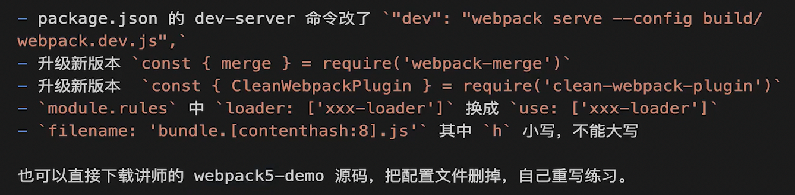

# 4升5的改动



# csp

## CSP 是如何工作的？

你可以通过两种方式开启 CSP：

1. **HTTP 响应头（推荐）：** 在服务器返回 HTML 时，加入 `Content-Security-Policy` 头部。
2. **HTML Meta 标签：** 在 `<head>` 标签中加入 `<meta http-equiv="Content-Security-Policy" content="...">`。

### 常用指令（Directives）

CSP 由一系列指令组成，每个指令控制一类资源的加载：

| **指令**              | **描述**                                             |
| --------------------- | ---------------------------------------------------- |
| **`default-src`**     | 默认策略，如果其他指令没定义，就按这个来。           |
| **`script-src`**      | 限制脚本的来源（最重要的指令）。                     |
| **`style-src`**       | 限制 CSS 样式的来源。                                |
| **`img-src`**         | 限制图片的来源。                                     |
| **`connect-src`**     | 限制 AJAX、WebSocket 等连接的来源。                  |
| **`frame-ancestors`** | 防止点击劫持（Clickjacking），限制谁能嵌入你的页面。 |

## nonce

你可以在 CSP 里写：

```
Content-Security-Policy: script-src 'self' 'nonce-abc123...';
```

然后在 HTML 里：

```
<script nonce="abc123...">/* 这段脚本被允许执行 */</script>
```

浏览器规则是：

> 只有 **带有匹配 nonce 的 script 标签** 才能执行

这样就算有人 XSS 注入了脚本，因为**没有正确 nonce**，也执行不了。


**要在“入口文件”里设置，而不是 webpack.config 里**

原因是：

- **nonce 必须是“每个页面请求唯一”的**
- 这个值通常是：
  - 服务端生成
  - 注入到 HTML / 全局变量中
- 比如 SSR / Node：

```
<script>
  window.__webpack_nonce__ = "{{serverGeneratedNonce}}";
</script>
<script src="/main.js" nonce="{{serverGeneratedNonce}}"></script>
```

如果你写死在 webpack 配置里：

- 所有人都是同一个 nonce ❌
- CSP 安全性直接打折 ❌

所以正确姿势是：

> 服务端生成 nonce → 注入到页面 → 入口 JS 读取并赋值给 `__webpack_nonce__`

------

### 为什么必须是 base64 字符串？

这是 **CSP 规范要求**：
 nonce 的格式必须是 **base64 编码**，否则浏览器可能直接忽略。


### 接力赋值

main.js 中

```js
__webpack_nonce__ = window.__webpack_nonce__;
```

之后的chunk文件在在<script/>便签中都会带上nonce="保存的值"


# 打包构建性能优化

## 动态导入

### `require` 语句

举个例子，假设你的目录结构如下：

```
example_directory
│
└───template
    │   table.ejs
    │   table-row.ejs
    │
    └───directory
        │   another.ejs
```

如果代码中写了如下 `require` 调用：

```
require('./template/' + name + '.ejs');
```

Webpack 无法确定 `name` 变量的具体值，因此，它会通过分析 `require` 调用创建一个上下文：

- **目录：** `./template`
- **正则表达式：** `^.*\.ejs$`（匹配所有 `.ejs` 文件）
- **上下文模块：** 这是一个包含所有 `.ejs` 文件的映射，Webpack 会创建如下的映射：

```
{
  "./table.ejs": 42,
  "./table-row.ejs": 43,
  "./directory/another.ejs": 44
}
```

在运行时，这个上下文模块还会包含一些逻辑，用来根据动态的 `require` 请求（比如传入 `name` 的不同值）找到对应的模块，并加载它。

**正确的做法应该是**

```js
import table from './template/table.ejs'
import row from './template/table-row.ejs'

const map = { table, row }
map[name] // name是动态的值， 通过map来动态的获取组件
```

因为这样可以避免把过多不会用到的模块也导入了进来


### `require.context` 函数

`require.context()` 是 Webpack 提供的一个特殊函数，可以帮助你定义自己的上下文。通过这个函数，你可以指定：

- 要搜索的目录
- 是否需要搜索子目录
- 匹配文件的正则表达式

这样，Webpack 就可以自动地识别并引入符合条件的文件，而不需要你显式地 `require` 每个文件。

**语法：**

```
require.context(
  directory,  // 要搜索的目录
  useSubdirectories = true,  // 是否递归子目录
  regExp = /^\.\/.*$/,  // 匹配文件的正则表达式
  mode = 'sync'  // 模式，可以是 'sync'（同步）或 'async'（异步）
);
```

**示例：**

```
require.context('./test', false, /\.test\.js$/);
```

这个例子会在 `./test` 目录中搜索所有以 `.test.js` 结尾的文件，并创建一个上下文。**`false`** 表示不递归搜索子目录。

#### 使用场景

##### 🚩 场景 1：自动注册（最经典）

```
const req = require.context('./icons', false, /\.svg$/)

req.keys().forEach(key => {
  const name = key.replace('./', '').replace('.svg', '')
  icons[name] = req(key)
})
```

你并不知道以后会加多少 icon 文件，但：

> **规则 = icons 目录下所有 svg**

这时候就必须用 context。

否则你只能手动：

```
import home from './icons/home.svg'
import user from './icons/user.svg'
import search from './icons/search.svg'
```

文件一多就爆炸。

##### 🚩 场景 2：插件系统 / 扩展机制

```
// 自动加载所有策略
const strategies = {}

const ctx = require.context('./strategies', false, /\.js$/)
ctx.keys().forEach(key => {
  const name = key.replace('./', '').replace('.js', '')
  strategies[name] = ctx(key).default
})
```

适用于：

- 表单校验规则
- 支付渠道适配
- 多平台适配层
- 富文本插件

👉 本质是：**让“加文件”=“扩展功能”**

##### 🚩 场景 4：i18n 语言包自动加载

```
const locales = {}
const ctx = require.context('./locales', false, /\.json$/)

ctx.keys().forEach(k => {
  const lang = k.match(/\.\/(.*)\.json/)[1]
  locales[lang] = ctx(k)
})
```

#### Vite 中的等价写法

在 Vite 里：

> ❌ 没有 `require.context`
>  ✅ 用 **`import.meta.glob`**

而且它**更强、更现代、还能天然 code-split**。

| Webpack             | Vite                                   |
| ------------------- | -------------------------------------- |
| `require.context()` | `import.meta.glob()`                   |
| 同步 require 目录   | 生成一个“模块路径 → import 函数”的映射 |
| 打包进同一个 bundle | 默认每个模块是独立 chunk（懒加载）     |

**Vite 写法**

```
const modules = import.meta.glob('./components/**/*.js')
```

这行代码得到的是：

```
{
  './components/A.js': () => import('./components/A.js'),
  './components/B.js': () => import('./components/B.js')
}
```

⚠️ 注意：**值是函数，不是模块**

------

##### 像 require 一样同步得到模块

用 `eager: true`

```
const modules = import.meta.glob('./components/**/*.js', { eager: true })
```

现在变成：

```
{
  './components/A.js': ModuleObject,
  './components/B.js': ModuleObject
}
```

这就等价于 Webpack context 的行为。

##### 只导出某个字段

```
const modules = import.meta.glob('./modules/*.js', {
  import: 'setup',
  eager: true
})
```

等价于：

```
import { setup } from './modules/a.js'
import { setup } from './modules/b.js'
```

##### **例如**

**Webpack 版本**

```
const ctx = require.context('./icons', false, /\.svg$/)
const icons = {}

ctx.keys().forEach(key => {
  const name = key.replace('./', '').replace('.svg', '')
  icons[name] = ctx(key)
})
```

------

**Vite 版本**

```
const icons = {}

const modules = import.meta.glob('./icons/*.svg', { eager: true })

Object.entries(modules).forEach(([path, mod]) => {
  const name = path.split('/').pop().replace('.svg', '')
  icons[name] = mod.default
})
```

## 做缓存

第一次构建：

- webpack 编译 a / b / c
- 把 loader 处理结果、AST、依赖关系
- **存进磁盘缓存**

第二次构建（你只改了 `c.ts`）：

- a / b → **直接从磁盘缓存读**
- c → 重新编译

```js
module.exports = {
  cache: {
    type: 'filesystem'
  }
}
```

当yarnlock.json文件发生了改变之后， 下一次打包构建应该运行postinstall

```json
{
  "scripts": {
    "postinstall": "rm -rf node_modules/.cache/webpack"
  }
}
```

### webpack4时代的做法：

#### DllPlugin 

------

##### 🧱 第一步：生成 DLL（单独跑一次）

**webpack.dll.config.js**

```
const webpack = require('webpack');
const path = require('path');

module.exports = {
  mode: 'production',
  entry: {
    vendor: ['react', 'react-dom', 'lodash']
  },
  output: {
    path: path.resolve(__dirname, 'dll'),
    filename: '[name].dll.js',
    library: '[name]_dll'
  },
  plugins: [
    new webpack.DllPlugin({
      name: '[name]_dll',
      path: path.resolve(__dirname, 'dll/[name]-manifest.json')
    })
  ]
};
```

运行：

```
npx webpack --config webpack.dll.config.js
```

你会得到：

```
dll/
 ├─ vendor.dll.js
 └─ vendor-manifest.json
```

------

###### 🧠 这两个文件是干嘛的？

| 文件                 | 作用                      |
| -------------------- | ------------------------- |
| vendor.dll.js        | 真正打好的第三方代码      |
| vendor-manifest.json | 模块名 → 模块 id 的映射表 |

------

##### 🔗 第二步：在主构建中“引用 DLL”

```
plugins: [
  new webpack.DllReferencePlugin({
    manifest: require('./dll/vendor-manifest.json')
  })
]
```

Webpack 看到：

```
import React from 'react';
```

不会再去 node_modules 里解析，而是：

> “哦，这个在 DLL 里，我直接用现成的”

------

#### 4️⃣ 它为什么能提速？

因为它**跳过了最耗时的部分**：

- ❌ 解析第三方源码
- ❌ loader 处理
- ❌ module graph 构建
- ❌ chunk 分析

➡️ 直接用已经存在的 module id + bundle

------

#### 5️⃣ 但它的代价是什么？（官网没说清楚的）

官网说：

> 尽管这增加了构建过程的复杂度

这句话 **非常保守**，现实是👇

❌ 代价 1：配置复杂

- 两套 webpack 配置
- 两套构建流程
- 新人极难理解

------

❌ 代价 2：依赖版本强耦合

- react 升级 → DLL 必须重打
- loader / babel 变化 → 可能不兼容
- lockfile 变化 → 潜在问题

------

❌ 代价 3：调试体验变差

- sourcemap 跨 bundle
- 报错堆栈不直观

------

❌ 代价 4：容易“缓存错乱”

- DLL 和主 bundle 不一致
- 极其隐蔽的 bug

## 文件模块寻找方面

### 减少 resolve.modules

当 webpack 看到一行代码：

```
import Button from '@/components/Button';
```

它不会“直接知道”文件在哪。

它会走一套**极其繁琐**的查找流程（这就是 `resolve`）

假设你有：

```
resolve: {
  modules: ['src', 'node_modules', 'lib', 'shared', '/']
  extensions: ['.js', '.ts', '.tsx'],
  mainFiles: ['index'],
  descriptionFiles: ['package.json']
}
```

webpack 实际在做的是：

```
1. 在 src/ 里找
   - Button.js
   - Button.ts
   - Button.tsx
   - Button/index.js
   - Button/index.ts
   - Button/index.tsx
   - Button/package.json → main?

2. 找不到再去 node_modules/
   - 同上流程
```

然后再没找到就照lib依次类推

👉 **每一步都是一次或多次磁盘 IO**

✅ 优化建议

- 只保留你真的会 import 的目录， 比方src
- 顺序很重要（常用的放前面）


### 减少resolve.extensions

我猜文件后缀

```
import App from './App';
```

webpack 会按顺序尝试：

```
./App.js
./App.ts
./App.tsx
./App.json
```

------

🚨 extensions 越多，灾难越大

```
extensions: ['.js', '.jsx', '.ts', '.tsx', '.mjs', '.json']
```

如果你项目里：

- 实际只用 `.ts / .tsx`
- 但 webpack 每次都要试 `.js / .jsx`

👉 全是 **无效 IO**

✅ 优化原则（重要）

> **你写什么，就只留什么**

- TS 项目：

  ```
  extensions: ['.ts', '.tsx']
  ```

- 如果你强制写后缀：

  ```
  import App from './App.tsx'
  ```

  那甚至可以：

  ```
  extensions: []
  ```

### 减少resolve.mainFiles

当你写：

```
import utils from './utils';
```

webpack 会尝试：

```
./utils/index.js
./utils/index.ts
./utils/index.tsx
```

### 总结

> 为什么大家喜欢省略后缀和 index？

你可以说：

> 这是为了可读性、可维护性和重构友好性。
>  解析性能确实会受到影响，但在现代 bundler 的缓存机制下，这个成本是可控的。
>  真正的性能问题应该通过合理的 resolve 配置和缓存解决，而不是牺牲代码质量

**❌ 极端性能场景**

- webpack 冷启动 > 60s
- 超大 monorepo
- 数万模块
- CI 严格时间限制

这种场景：

- 可能要求写全后缀
- 严格限制 extensions
- 禁止随意 index.ts


**不是极端性能场景的话， 还是不需要这么做优化的**


## 关闭symlinks

webpack 默认行为（symlinks: true）

webpack 会：

1. 解析真实路径
2. 用真实路径做模块唯一标识
3. 确保不会重复打包

------

这一步有多贵？

- `fs.realpath`
- 多次路径比对
- 每个 module 都来一次

------

如果你 **完全不用 link**

那这一步就是：

> **纯浪费**

------

✅ 优化方式

```
resolve: {
  symlinks: false
}
```

效果：

- 不再追踪真实路径
- 直接用表面路径
- **减少大量 fs 调用**

## 关闭cacheWithContext

什么是 context？

解析时，webpack 不只看：

```
'import lodash'
```

还看：

```
它是从哪个文件 import 的？
```

------

默认缓存 key 是：

```
(request + context)
```

------

cacheWithContext: true（默认）

```
import 'lodash'; // 在 a.js
import 'lodash'; // 在 b.js
```

👉 解析两次（因为 context 不同）

------

cacheWithContext: false

```
import 'lodash'; // 在任意地方
```

👉 **解析一次，全局复用**

------

那为什么不默认关？

因为有些插件会：

- 根据 import 来源路径
- 改变解析结果

------

**你可以安全关闭的前提是：**

- 使用了自定义 resolve plugin
- 但插件逻辑 **与 context 无关**
- 或者你压根没用自定义 resolve plugin

------

### ✅ 设置方式

```
resolve: {
  cacheWithContext: false
}
```

## 使用线程loader

```js
module.exports = {
  module: {
    rules: [
      {
        test: /\.[jt]sx?$/,
        include: /src/,
        use: [
          {
            loader: 'thread-loader',
            options: {
              workers: 2,
              workerParallelJobs: 50
            }
          },
          {
            loader: 'babel-loader',
            options: {
              cacheDirectory: true
            }
          }
        ]
      }
    ]
  }
};

```

| 参数               | 含义                        |
| ------------------ | --------------------------- |
| workers            | worker 数量（CPU 核数 - 1） |
| workerParallelJobs | 单 worker 可并发任务        |
| poolTimeout        | 空闲多久后关闭 worker       |

✅ 强烈推荐的场景

- 项目很大（几千 JS 文件）
- Babel / TS 转译时间占比高
- 冷启动很慢
- CI 构建时间长

**注意事项：**

与缓存一起用才有意义，不然：

- worker 每次都重跑
- 性价比骤降


**worker 数不是越多越好**

否则：

- 上下文切换成本 > 并行收益

 **dev 模式慎用**

worker 初始化慢

热更新反而变慢


6️⃣ 什么时候 **真的值得用**？

✅ 强烈推荐的场景

- 项目很大（几千 JS 文件）
- Babel / TS 转译时间占比高
- 冷启动很慢
- CI 构建时间长

**thread-loader 是“给慢 loader 的止痛药”，**
 **不是 webpack 性能优化的终极解法。**


## runtime  chunk

runtime **对结构变化极其敏感**
 但在结构稳定的前提下，**它本身是高度稳定的**

**runtime 被拆出来之后，发生了什么变化？**

对比一下「变化源」

**❌ runtime 混在 entry 里时**

runtime 依赖的是：

- 所有 chunk 的 hash
- entry 内容
- vendor 内容
- 业务模块变动

👉 **任何业务改动都会“拖着 runtime 一起变”**

------

✅ runtime 独立之后

runtime 只依赖：

- chunk **结构**
- chunk **名称**
- chunk **加载关系**

而**不依赖**：

- chunk 里的具体业务代码
- 模块内部实现细节

------

所以才有这句话：

> 模块结构不变 → runtime 不变

### 配置

**开发环境**

1️⃣ HMR 会频繁改 runtime

- runtime 是 HMR 的一部分
- 拆出来反而：
  - chunk 更多
  - HMR 通信更复杂
  - 调试更难

------

2️⃣ 缓存根本没意义

- 开发环境：
  - 不走 CDN
  - 不关心 hash
  - 不做 long-term cache

👉 runtime 拆不拆 **对性能无意义**

------

3️⃣ 构建速度更重要

runtimeChunk：

- 增加一次 chunk 生成
- 增加 chunk graph 计算

开发环境 **能省就省**

```json
optimization: {
  runtimeChunk: false,
}
```

**生产环境**

```js
runtimeChunk: { name: 'runtime' }
```

或者

```js
optimization: {
  runtimeChunk: 'single',
}
```

这两种写法是一样的

名字固定， 独立， 适合CDN和浏览器缓存

runtime **只在 chunk 结构变时才变**

CDN / 浏览器可长期缓存

多入口共享一个 runtime（重要）


注意： 在多入口的项目中，不要

```js
runtimeChunk: true
```

因为多入口的时候， 这样配置， 名字会很不稳定


## ts的编译优化

```js
const ForkTsCheckerWebpackPlugin = require('fork-ts-checker-webpack-plugin');

module.exports = {
  module: {
    rules: [
      {
        test: /\.tsx?$/,
        use: [
          {
            loader: 'ts-loader',
            options: {
              transpileOnly: true, // 只转译，不做类型检查
            },
          },
        ],
        exclude: /node_modules/,
      },
    ],
  },
  plugins: [
    new ForkTsCheckerWebpackPlugin({
      async: true, // 开发模式下异步报告错误
      typescript: {
        diagnosticOptions: {
          semantic: true,
          syntactic: true,
        },
      },
    }),
  ],
};

```

Ts-loder只做转义， 不做类型检查， 然后ForkTsCheckerWebpackPlugin单独开辟一个线程来进行类型检查， 可以配置ForkTsCheckerWebpackPlugin让发现类型检查有错误的时候提醒， 或者中断构建


## 开发环境

### 不要用stats.toJson()

```js
compiler.hooks.done.tap('xxx', stats => {
  const json = stats.toJson(); // ⚠️ 慢
});

```

❗ 自定义插件 / 中间件 / dev-server 扩展

- 日志插件
- 构建分析
- 上报构建结果

**👉 不要在 watch / dev 模式全量 toJson**

3️⃣ 正确姿势

```
stats.toJson({
  all: false,
  errors: true,
  warnings: true,
})
```

或者干脆：

```
stats.hasErrors()
stats.hasWarnings()
```

### devtool的配置

| devtool                      | 速度  | 调试体验 | 推荐     |
| ---------------------------- | ----- | -------- | -------- |
| eval                         | ⭐⭐⭐⭐⭐ | ❌        | 不推荐   |
| cheap-source-map             | ⭐⭐⭐   | ⭐⭐       | 一般     |
| eval-source-map              | ⭐⭐⭐⭐  | ⭐⭐⭐⭐     | 可用     |
| eval-cheap-module-source-map | ⭐⭐⭐⭐  | ⭐⭐⭐⭐     | ✅ 最推荐 |

"eval" 具有最好的性能，但并不能帮助转译代码

`cheap-source-map`：牺牲精度换速度 只精确到「行」，不精确到「列」

`eval-source-map`：为「增量编译」而生； 模块级更新不需要重新生成完整 map 文件，HMR 时只更新改动模块 **保存文件 → 反馈速度非常快**

`eval-cheap-module-source-map`（官方推荐）

| 问题                | 解决情况            |
| ------------------- | ------------------- |
| 构建慢              | eval + cheap → 快   |
| TS / Babel 行号不准 | module → 映射到源码 |
| 增量编译慢          | eval → 只更新模块   |

```js
module.exports = {
  mode: 'development',
  devtool: 'eval-cheap-module-source-map',
};
```

**生产环境** 

```json
devtool: 'source-map'
// 或 hidden-source-map
```


### 避免使用在生产环境下才会用到的工具

#### 1️⃣ TerserPlugin（代码压缩 / 混淆）

**作用**

- 压缩 JS
- 删除无用代码
- 变量重命名、混淆

**为什么不该用在开发环境**

- 构建慢（AST 级别操作）
- 报错行号对不上
- `console.log`、变量名被改，调试极度痛苦

**开发环境要的**

- 可读源码
- 清晰报错
- 快速 rebuild

✅ **结论**：只在 `production` 用


#### 2️⃣ `[fullhash] / [chunkhash] / [contenthash]`

**作用**

- 用于 **浏览器缓存控制**
- 文件内容变 → hash 变 → 强制浏览器更新

**为什么不该用在开发环境**

- 每次构建 hash 都变
- 文件名不停变，HMR 失效或变慢
- 无意义：开发环境几乎不走缓存

**开发环境推荐**

```
filename: '[name].js'
```

#### 3️⃣ AggressiveSplittingPlugin（激进拆包）

**作用**

- 把 bundle 拆得非常碎
- 减少单个文件体积

**为什么不该用在开发环境**

- chunk 数量暴增
- 网络请求变多
- source map 定位困难
- 构建时间 ↑


#### 4️⃣ AggressiveMergingPlugin（激进合包）

**作用**

- 尝试合并体积较小的 chunk
- 降低请求数量

**为什么不该用在开发环境**

- 不停计算“合不合适”
- 构建耗时
- 对开发体验没有任何提升


#### 5️⃣ ModuleConcatenationPlugin（Scope Hoisting）

**作用**

- 把多个模块合并到一个作用域
- 减少函数包裹
- 提升运行时性能

**为什么不该用在开发环境**

- 破坏模块边界
- source map 变差
- 调试时“代码对不上文件”


### 关闭不必要的优化

```js
module.exports = {
  // ...
  optimization: {
    removeAvailableModules: false,
    removeEmptyChunks: false,
    splitChunks: false,
  },
};
```

#### **splitChunks**

splitChunks 默认是打开的

```
splitChunks: {
  chunks: 'all',
}
```

webpack 会：

- 分析 module 使用频率

- 尝试：

  - 抽公共模块

  - 抽 vendor

  - 平衡 chunk 大小

  - 需要反复尝试组合：

    - A + B + C？
    - 还是 A + C？

    chunk 命中率、体积、请求数都要考虑

#### removeAvailableModules

removeAvailableModules默认是true

webpack 会：

- 扫描所有 chunk
- 如果某个 module：
  - 已经在父 chunk 中存在
  - 子 chunk 再包含它就**没意义**
- 👉 把它从子 chunk 中移除

**为什么这一步很慢？**

因为它需要：

- 构建完整 **module graph**
- 对每个 chunk 做 **包含关系判断**
- 在大型项目中：
  - module 数量 = 几千 / 几万
  - chunk 数量 = 上百

关掉之后可能会多一点重复代码

但：

- chunk 构建速度明显提升
- 内存占用下降


#### removeEmptyChunks

默认是true

webpack 会：

- 在 chunk 拆分 / 合并后
- 检查：
  - 有没有 **已经没有 module 的 chunk**
- 👉 如果是空的，直接删掉

chunk 是多轮生成的

每一轮都可能：

- 生成临时空 chunk
- 再被合并

webpack 需要：

- 不断扫描 chunk graph
- 做拓扑调整


#### pathinfo

```js
module.exports = {
  output: {
    pathinfo: false,
  },
};
```

打包生成的bundle中会有代码来自于哪个文件的注释

在开发环境中， 是默认打开的， 在生产环境中是默认关闭的

在开发环境中关闭它， 可以减少内存占用， 加快构建速度， 减小产物体积，代价是bundle可读性变差


## 生产环境

### source map 

这个东西很耗资源， 所以要确保真的需要它


### 工具相关的问题

#### Babel

Babel 的工作方式是：
 **每个文件都会按顺序跑一遍你配置的所有 preset + plugin**。

比如你这样配：

```
presets: [
  "@babel/preset-env",
  "@babel/preset-react",
  "@babel/preset-typescript"
],
plugins: [
  "plugin-a",
  "plugin-b",
  "plugin-c",
  "plugin-d"
]
```

那 **每个 JS/TS 文件 = 至少跑 7 次 AST 转换流程**。
 项目一大，文件一多，构建时间直接爆炸 💥

**改进**

能不用的就别用

能合并的就合并

别“为了以后可能用”提前装一堆插件

检查 preset-env 的 targets，避免无意义的降级转换


## 模块热替换

原理：

1、修改了一个文件之后， webpack会重新编译这个模块， 然后生成新的模块大吗， 生成一个hot-update.json文件和 hot-update.js文件

2、 webpack-dev-server 内部启动一个 WebSocket 服务。浏览器端 runtime 连接这个 socket。文件更新后：服务器会推送消息：


# 常用插件


## css相关

### HtmlWebpackPlugin

用这个插件会自动注入css  js 等其他资源文件到 html文件中

```js
const HtmlWebpackPlugin = require('html-webpack-plugin');

plugins: [
    new HtmlWebpackPlugin({
      template: path.join(__dirname, '../src/index.html'),
      filename: 'index.html',
    })
]
```

## 工程构建相关

### webpack.DefinePlugin

作用是在编译期间定义全局常量；

`DefinePlugin` 是**字符串替换**，所以必须 `JSON.stringify` 加引号，否则生成的代码可能是非法的。

它不会在浏览器的 `window` 上挂 `ENV` 变量（不是 `window.ENV`），而是作用于模块内部全局作用域。

```js
new webpack.DefinePlugin({
  ENV: JSON.stringify(process.env.NODE_ENV), // 'development' or 'production'
  DEBUG_MODE: JSON.stringify(true),
  VERSION: JSON.stringify('1.2.3')
})
```

## 构建进度显示

### ProgressPlugin 的“成本”来自哪里？

#### ① 高频回调

Webpack 构建过程是：

- **成千上万个 module**
- **极其频繁的状态变化**

ProgressPlugin 会：

- 监听大量 hook
- 不断计算进度
- 不断输出日志

➡️ 本质是 **额外的同步工作**

------

#### ② 控制台 IO 非常慢（尤其是 CI）

在本地你可能感觉不明显，但在：

- CI（GitHub Actions / GitLab CI）
- Docker
- 远程终端

👉 **console.log 本身就是性能杀手**

### ✅ 值得用的场景

- 首次全量构建 1~5 分钟
- 排查构建卡住 / 停滞
- 给非技术人员看「正在构建中」
- CLI 工具 / 可视化打包器

------

### ❌ 不值得用的场景

- dev 模式
- HMR
- CI
- 小中型项目
- 追求极致冷启动时间

# babel配置 处理ES6

.babelrc文件

```
{
	"presets": ["@babel/preset-env"],
	"plugins": []
}
```

```
rules: [
  {
    test: /\.(js|jsx)$/,
    exclude: /node_modules/,
    use: ['babel-loader']
  }
],
```


# 配置样式

## postcss-loader添加前缀

```
npm i -D postcss-loader autoprefixer postcss
```

postcss.config.js文件

```js
module.exports = {
    plugins: [require('autoprefixer')]
}
```

```js
{
    test: /\.less$/,
    use: ['style-loader', 'css-loader', 'postcss-loader', 'less-loader'],
},
```

测试就用：

```css
div{
    user-select: none;
}
```


## 抽离css文件mini-css-extract-plugin

**注意，在module/rules之下配置了之后，还要在plugin里面引用；**

```
npm i -D mini-css-extract-plugin
```

```js
const MiniCssExtractPlugin = require('mini-css-extract-plugin')
```

```js
{
    test: /\.css$/,
    use: [MiniCssExtractPlugin.loader, 'css-loader', 'postcss-loader'],
},
{
    test: /\.less$/,
    use: [MiniCssExtractPlugin.loader, 'css-loader', 'postcss-loader', 'less-loader'],
}
```
配置输出名字的时候，还能css/的方式，把样式文件放到css文件夹中
```js
plugins: [
    new MiniCssExtractPlugin({
      filename: 'css/[name].[contenthash:8].css',
    })
]
```


# 文件处理

## 图片

### dev环境file-loader

```js
{
    test: /\.(png|jpe?g|gif|svg)$/,
    use: 'file-loader'
}
```

### prod环境url-loader

把小的文件直接转换成base64； 可以减少http请求

```js
 rules: [
  {
    test: /\.(png|jpe?g|gif|svg)$/,
    use: {
      loader: 'url-loader',
      options: {
        limit: 8192,
        outputPath: 'images',
      }
    }
  }
]
```

# 输出文件名管理

[contenthash:8] 取8位hash拼接；hash是根据内容生成，内容不变hash不变

```js
output: {
    path: path.resolve(__dirname, '../dist'),
    filename: '[name].[contenthash:8].js',
},
```


# 入口配置

```js
 entry: path.join(__dirname, '../', 'src/index.js'),
```

普通情况下有只有一个入口，这样配置会默认生成main.js文件

如果想要给生成的文件自定义命名可以通过下面这种方式

```js
entry: {
    dingkaile: path.join(__dirname, '../', 'src/index.js'),
  },
```


## 多入口处理

```js
entry: {
    index: path.join(__dirname, '../', 'src/index.js'),
    other: path.join(__dirname, '../', 'src/other.js')
},
```

```js
new HtmlWebpackPlugin({
  template: path.join(__dirname, '../src/index.html'),
  filename: 'index.html',
  chunks: ['index']
}),
new HtmlWebpackPlugin({
  template: path.join(__dirname, '../src/other.html'),
  filename: 'other.html',
  chunks: ['other']
}),
```

如果没有配置chunks， 那么就会默认把生成的js文件都嵌入

# 管理输出

## 清理dist文件夹

Webpack 5 的 `output.clean` 可以替代 `clean-webpack-plugin` 的基础能力，但插件在多目录、保留文件和复杂清理规则上更灵活。

### webpack5自带的清理功能配置：

```json
output: {
 	filename: '[name].bundle.js',
 	path: path.resolve(__dirname, 'dist'),
	clean: true,
}
```

### clean-webpack-plugin自动清理

```
npm i -D clean-webpack-plugin
```

```js
const {CleanWebpackPlugin} = require('clean-webpack-plugin')
```

```js
plugins: [
	new CleanWebpackPlugin(),
]
```


# 压缩代码

```
npm i -D terser-webpack-plugin css-minimizer-webpack-plugin
```

```js
// webpack.config.js
const TerserPlugin = require('terser-webpack-plugin');
const CssMinimizerPlugin = require('css-minimizer-webpack-plugin');

module.exports = {
  // ... 其他配置
  optimization: {
    minimize: true,
    minimizer: [
      new TerserPlugin({
          terserOptions: {
            compress: {
              drop_console: true, // 删除 console.*
              drop_debugger: true, // 删除 debugger
            },
            format: {
              comments: false, // 删除注释
            },
          },
          extractComments: false, // 不生成 .LICENSE.txt 第三方库版权声明文件
        }),
      new CssMinimizerPlugin(),
    ],
  },
};

```


# 抽离代码

```js
optimization: {
    splitChunks: {
      chunks: 'all',
      cacheGroups: {
        vendors: {
          name: 'vendors',
          test: /[\\/]node_modules[\\/]/,
          priority: 1, // 优先级
          minChunks: 1, // 被复用过多少次
          minSize: 0,
        },
        common: {
          name: 'common',
          priority: 0,
          minSize: 0,
          minChunks: 2,
        }
      }
    }
},
```

**priority** 是优先级，如果它命中了vendor规则，还命中了common规则，那么就看谁的优先级高就依谁

**minChunks**是被复用过多少次，通常node_modules是这只只要命中一次就抽离

**minSize**是公共模块文件大小；如果文件很小的话，就没必要单独抽离出来了，这个时候把它“复制粘贴”到main.js中更划算； 这样可以避免一次请求；通常设置3kb

```js
 plugins: [
    new HtmlWebpackPlugin({
      template: path.join(__dirname, '../src/index.html'),
      filename: 'index.html',
      chunks: ['index', 'vendors', 'common']
    }),
    new HtmlWebpackPlugin({
      template: path.join(__dirname, '../src/other.html'),
      filename: 'other.html',
      chunks: ['other', 'common']
    }),
    new webpack.DefinePlugin({
      ENV: JSON.stringify(process.env.NODE_ENV)
    })
  ]
```

多入口项目中可以这样设置html需要引入哪些js文件

 

# 异步加载

```js
module.exports = {
  optimization: {
    splitChunks: {
      chunks: 'all',
    },
  },
}
```

采用 import() 函数进行动态导入代码，从而实现异步加载； 优化加载速度，减少初次加载时间

```js
// 使用动态导入
button.addEventListener('click', () => {
  import('./math.js').then(module => {
    const add = module.add;
    console.log(add(1, 2));
  });
});
```

WebPack 会根据代码的引入方式生成动态文件。动态导入后，Webpack 会创建一个新的 bundle，并在需要时进行加载


# module chunk bundle 的区别

+ module：各个源码文件，webpack中一切皆模块
+ chunk： 多个模块合并而成的片段
  + 代码分割
  + entry入口
  + 异步加载等方式实现的
+ bundle  最终的输出文件


# babel-loader优化

1. **`cacheDirectory`**
   - **作用**：决定是否启用缓存，以及缓存存储的位置。启用缓存可以提高后续构建的速度，因为它会保存上次转换的结果，下次如果相同的文件没有改变，就可以直接使用缓存。
   - **适用场景**：如果项目很大，构建时间长，开启缓存能加速后续的构建。
2. **`cacheIdentifier`**
   - **作用**：这是缓存的唯一标识符。如果你修改了 `babel` 或相关配置，它会重新生成缓存。可以通过自定义标识符来确保缓存失效。
   - **适用场景**：你可能需要在不同版本之间清理缓存时，或者在某些特定情况下希望手动控制缓存的有效性。
3. **`cacheCompression`**
   - **作用**：控制是否使用 Gzip 压缩缓存文件。默认是开启的，这样可以减小缓存的文件大小。关闭时，缓存将不进行压缩。
   - **适用场景**：如果你有成千上万的文件需要处理，关闭压缩可能会提高构建性能。否则，默认开启压缩能节省磁盘空间。
4. **`customize`**
   - **作用**：允许你自定义 `babel-loader` 的行为。你可以传入自定义的回调函数来定制转换过程中的某些环节。
   - **适用场景**：当你需要在构建过程中做一些特殊的定制化处理（比如增加自定义插件）时，可以使用它。


# 忽略无用文件

Webpack 默认会把代码里出现的 `require()` 或 `import` 全部打包，但有时候我们并不想要所有文件，这时就可以用 Ignore Plugin 告诉 Webpack：这部分内容你忽略，不要打包

**`resourceRegExp`**：匹配**要忽略的文件名或路径**

**`contextRegExp`**：匹配**在哪个目录下的这个文件**

两个条件必须**同时匹配**才会忽略

忽略后需要**手动引入必要的文件**

```js
const webpack = require('webpack');

module.exports = {
  plugins: [
    // 忽略 moment 所有 locale
    new webpack.IgnorePlugin({
      resourceRegExp: /^\.\/locale$/,
      contextRegExp: /moment$/
    }),

    // 忽略 dayjs 所有 locale
    new webpack.IgnorePlugin({
      resourceRegExp: /^\.\/locale$/,
      contextRegExp: /dayjs$/
    }),

    // 忽略 highlight.js 所有语言包
    new webpack.IgnorePlugin({
      resourceRegExp: /^\.\/languages$/,
      contextRegExp: /highlight\.js$/
    }),
  ]
};

```

```js
const webpack = require('webpack');

const ignoreConfigs = [
  { resource: /^\.\/locale$/, context: /moment$/ },
  { resource: /^\.\/locale$/, context: /dayjs$/ },
  { resource: /^\.\/languages$/, context: /highlight\.js$/ }
];

module.exports = {
  plugins: [
    ...ignoreConfigs.map(cfg => new webpack.IgnorePlugin({
      resourceRegExp: cfg.resource,
      contextRegExp: cfg.context
    }))
  ]
};

```

```js
const webpack = require('webpack');

module.exports = {
  plugins: [
    new webpack.IgnorePlugin({
      resourceRegExp: /^\.\/(locale|languages)$/,
      contextRegExp: /(moment|dayjs|highlight\.js)$/
    })
  ]
};

```

```js
import moment from 'moment';
import 'moment/locale/zh-cn';  // 因为这里已经被忽略掉了，所以需要手动引入，后续才能继续使用

moment.locale('zh-cn');

```


