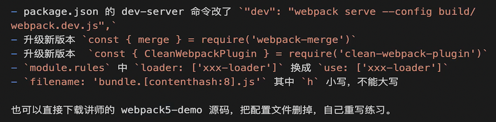

# 4升5的改动




# HtmlWebpackPlugin

用这个插件会自动注入css  js 等其他资源文件到 html文件中

```js
const HtmlWebpackPlugin = require('html-webpack-plugin');

plugins: [
    new HtmlWebpackPlugin({
      template: path.join(__dirname, '../src/index.html'),
      filename: 'index.html',
    })
]
```


# webpack.DefinePlugin

作用是在编译期间定义全局常量；

`DefinePlugin` 是**字符串替换**，所以必须 `JSON.stringify` 加引号，否则生成的代码可能是非法的。

它不会在浏览器的 `window` 上挂 `ENV` 变量（不是 `window.ENV`），而是作用于模块内部全局作用域。

```js
new webpack.DefinePlugin({
  ENV: JSON.stringify(process.env.NODE_ENV), // 'development' or 'production'
  DEBUG_MODE: JSON.stringify(true),
  VERSION: JSON.stringify('1.2.3')
})
```


# webpack-dev-server启动本地开发服务

```
npm i -D webpack-dev-server
```

```js
devServer: {
    static: {
      directory: path.resolve(__dirname, '../dist')
    },
    compress: true, // 启动gzip压缩
    open: true,
    port: 9000,
    proxy: {
      '/api': "http://loacalhost:3000",
      '/api2': {
        target: 'http://localhost:3000',
        pathRewrite: {
          '/api2': ''
        }
      }
    }
  }
```

```
"dev": "webpack-dev-server --config build-base/webpack.dev.js"
```


# 处理ES6 配置babel

.babelrc文件

```
{
	"presets": ["@babel/preset-env"],
	"plugins": []
}
```

```
rules: [
  {
    test: /\.(js|jsx)$/,
    exclude: /node_modules/,
    use: ['babel-loader']
  }
],
```


# 配置样式

## postcss-loader添加前缀

```
npm i -D postcss-loader autoprefixer postcss
```

postcss.config.js文件

```js
module.exports = {
    plugins: [require('autoprefixer')]
}
```

```js
{
    test: /\.less$/,
    use: ['style-loader', 'css-loader', 'postcss-loader', 'less-loader'],
},
```

测试就用：

```css
div{
    user-select: none;
}
```


## 抽离css文件mini-css-extract-plugin

**注意，在module/rules之下配置了之后，还要在plugin里面引用；**

```
npm i -D mini-css-extract-plugin
```

```js
const MiniCssExtractPlugin = require('mini-css-extract-plugin')
```

```js
{
    test: /\.css$/,
    use: [MiniCssExtractPlugin.loader, 'css-loader', 'postcss-loader'],
},
{
    test: /\.less$/,
    use: [MiniCssExtractPlugin.loader, 'css-loader', 'postcss-loader', 'less-loader'],
}
```
配置输出名字的时候，还能css/的方式，把样式文件放到css文件夹中
```js
plugins: [
    new MiniCssExtractPlugin({
      filename: 'css/[name].[contenthash:8].css',
    })
]
```


# 处理图片

## dev环境file-loader

```js
{
    test: /\.(png|jpe?g|gif|svg)$/,
    use: 'file-loader'
}
```

## prod环境url-loader

把小的文件直接转换成base64； 可以减少http请求

```js
 rules: [
  {
    test: /\.(png|jpe?g|gif|svg)$/,
    use: {
      loader: 'url-loader',
      options: {
        limit: 8192,
        outputPath: 'images',
      }
    }
  }
]
```

# 输出文件名管理

[contenthash:8] 取8位hash拼接；hash是根据内容生成，内容不变hash不变

```js
output: {
    path: path.resolve(__dirname, '../dist'),
    filename: '[name].[contenthash:8].js',
},
```


# 入口配置

```js
 entry: path.join(__dirname, '../', 'src/index.js'),
```

普通情况下有只有一个入口，这样配置会默认生成main.js文件

如果想要给生成的文件自定义命名可以通过下面这种方式

```js
entry: {
    dingkaile: path.join(__dirname, '../', 'src/index.js'),
  },
```


## 多入口处理

```js
entry: {
    index: path.join(__dirname, '../', 'src/index.js'),
    other: path.join(__dirname, '../', 'src/other.js')
},
```

```js
new HtmlWebpackPlugin({
  template: path.join(__dirname, '../src/index.html'),
  filename: 'index.html',
  chunks: ['index']
}),
new HtmlWebpackPlugin({
  template: path.join(__dirname, '../src/other.html'),
  filename: 'other.html',
  chunks: ['other']
}),
```

如果没有配置chunks， 那么就会默认把生成的js文件都嵌入


# clean-webpack-plugin自动清理

```
npm i -D clean-webpack-plugin
```

```js
const {CleanWebpackPlugin} = require('clean-webpack-plugin')
```

```js
plugins: [
	new CleanWebpackPlugin(),
]
```


# 压缩代码

```
npm i -D terser-webpack-plugin css-minimizer-webpack-plugin
```

```js
// webpack.config.js
const TerserPlugin = require('terser-webpack-plugin');
const CssMinimizerPlugin = require('css-minimizer-webpack-plugin');

module.exports = {
  // ... 其他配置
  optimization: {
    minimize: true,
    minimizer: [
      new TerserPlugin({
          terserOptions: {
            compress: {
              drop_console: true, // 删除 console.*
              drop_debugger: true, // 删除 debugger
            },
            format: {
              comments: false, // 删除注释
            },
          },
          extractComments: false, // 不生成 .LICENSE.txt 第三方库版权声明文件
        }),
      new CssMinimizerPlugin(),
    ],
  },
};

```


# 抽离代码

```js
optimization: {
    splitChunks: {
      chunks: 'all',
      cacheGroups: {
        vendors: {
          name: 'vendors',
          test: /[\\/]node_modules[\\/]/,
          priority: 1, // 优先级
          minChunks: 1, // 被复用过多少次
          minSize: 0,
        },
        common: {
          name: 'common',
          priority: 0,
          minSize: 0,
          minChunks: 2,
        }
      }
    }
},
```

**priority** 是优先级，如果它命中了vendor规则，还命中了common规则，那么就看谁的优先级高就依谁

**minChunks**是被复用过多少次，通常node_modules是这只只要命中一次就抽离

**minSize**是公共模块文件大小；如果文件很小的话，就没必要单独抽离出来了，这个时候把它“复制粘贴”到main.js中更划算； 这样可以避免一次请求；通常设置3kb

```js
 plugins: [
    new HtmlWebpackPlugin({
      template: path.join(__dirname, '../src/index.html'),
      filename: 'index.html',
      chunks: ['index', 'vendors', 'common']
    }),
    new HtmlWebpackPlugin({
      template: path.join(__dirname, '../src/other.html'),
      filename: 'other.html',
      chunks: ['other', 'common']
    }),
    new webpack.DefinePlugin({
      ENV: JSON.stringify(process.env.NODE_ENV)
    })
  ]
```

多入口项目中可以这样设置html需要引入哪些js文件

 

# 异步加载

```js
module.exports = {
  optimization: {
    splitChunks: {
      chunks: 'all',
    },
  },
}
```

采用 import() 函数进行动态导入代码，从而实现异步加载； 优化加载速度，减少初次加载时间

```js
// 使用动态导入
button.addEventListener('click', () => {
  import('./math.js').then(module => {
    const add = module.add;
    console.log(add(1, 2));
  });
});
```

WebPack 会根据代码的引入方式生成动态文件。动态导入后，Webpack 会创建一个新的 bundle，并在需要时进行加载


# module chunk bundle 的区别

+ module：各个源码文件，webpack中一切皆模块
+ chunk： 多个模块合并而成的片段
  + 代码分割
  + entry入口
  + 异步加载等方式实现的
+ bundle  最终的输出文件


# babel-loader优化

1. **`cacheDirectory`**
   - **作用**：决定是否启用缓存，以及缓存存储的位置。启用缓存可以提高后续构建的速度，因为它会保存上次转换的结果，下次如果相同的文件没有改变，就可以直接使用缓存。
   - **适用场景**：如果项目很大，构建时间长，开启缓存能加速后续的构建。
2. **`cacheIdentifier`**
   - **作用**：这是缓存的唯一标识符。如果你修改了 `babel` 或相关配置，它会重新生成缓存。可以通过自定义标识符来确保缓存失效。
   - **适用场景**：你可能需要在不同版本之间清理缓存时，或者在某些特定情况下希望手动控制缓存的有效性。
3. **`cacheCompression`**
   - **作用**：控制是否使用 Gzip 压缩缓存文件。默认是开启的，这样可以减小缓存的文件大小。关闭时，缓存将不进行压缩。
   - **适用场景**：如果你有成千上万的文件需要处理，关闭压缩可能会提高构建性能。否则，默认开启压缩能节省磁盘空间。
4. **`customize`**
   - **作用**：允许你自定义 `babel-loader` 的行为。你可以传入自定义的回调函数来定制转换过程中的某些环节。
   - **适用场景**：当你需要在构建过程中做一些特殊的定制化处理（比如增加自定义插件）时，可以使用它。


# 忽略无用文件

Webpack 默认会把代码里出现的 `require()` 或 `import` 全部打包，但有时候我们并不想要所有文件，这时就可以用 Ignore Plugin 告诉 Webpack：这部分内容你忽略，不要打包

**`resourceRegExp`**：匹配**要忽略的文件名或路径**

**`contextRegExp`**：匹配**在哪个目录下的这个文件**

两个条件必须**同时匹配**才会忽略

忽略后需要**手动引入必要的文件**

```js
const webpack = require('webpack');

module.exports = {
  plugins: [
    // 忽略 moment 所有 locale
    new webpack.IgnorePlugin({
      resourceRegExp: /^\.\/locale$/,
      contextRegExp: /moment$/
    }),

    // 忽略 dayjs 所有 locale
    new webpack.IgnorePlugin({
      resourceRegExp: /^\.\/locale$/,
      contextRegExp: /dayjs$/
    }),

    // 忽略 highlight.js 所有语言包
    new webpack.IgnorePlugin({
      resourceRegExp: /^\.\/languages$/,
      contextRegExp: /highlight\.js$/
    }),
  ]
};

```

```js
const webpack = require('webpack');

const ignoreConfigs = [
  { resource: /^\.\/locale$/, context: /moment$/ },
  { resource: /^\.\/locale$/, context: /dayjs$/ },
  { resource: /^\.\/languages$/, context: /highlight\.js$/ }
];

module.exports = {
  plugins: [
    ...ignoreConfigs.map(cfg => new webpack.IgnorePlugin({
      resourceRegExp: cfg.resource,
      contextRegExp: cfg.context
    }))
  ]
};

```

```js
const webpack = require('webpack');

module.exports = {
  plugins: [
    new webpack.IgnorePlugin({
      resourceRegExp: /^\.\/(locale|languages)$/,
      contextRegExp: /(moment|dayjs|highlight\.js)$/
    })
  ]
};

```

```js
import moment from 'moment';
import 'moment/locale/zh-cn';  // 因为这里已经被忽略掉了，所以需要手动引入，后续才能继续使用

moment.locale('zh-cn');

```


