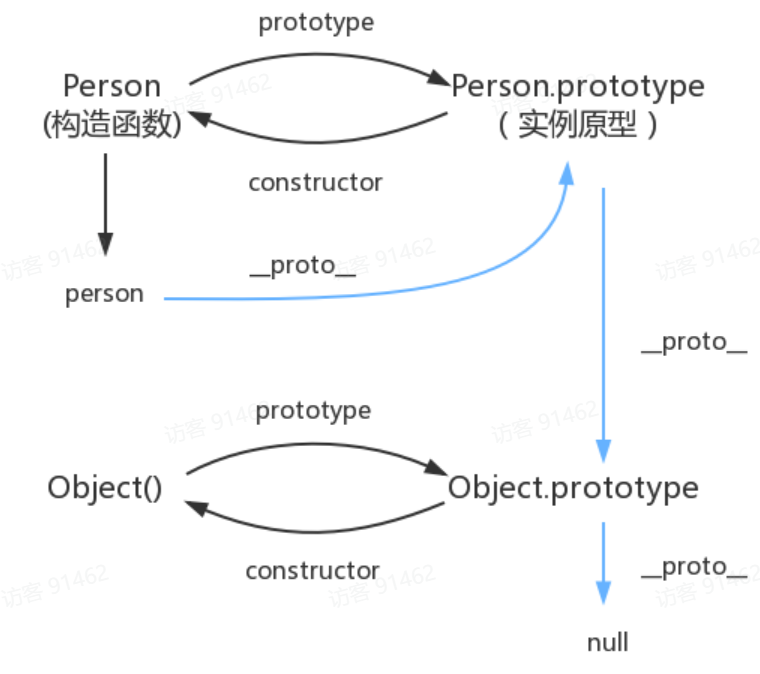

# 原型链



```js
function Person() {

}

var person = new Person();

console.log(person.__proto__ == Person.prototype) // true

console.log(Person.prototype.constructor == Person) // true

console.log(Object.getPrototypeOf(person) === Person.prototype) // true
```

# 作用域

作用域是指程序源代码中定义变量的区域。

作用域规定了如何查找变量，也就是确定当前执行代码对变量的访问权限。

JavaScript 采用词法作用域`(lexical scoping`)，也就是静态作用域；**函数的作用域在函数定义的时候就决定了**；


与词法作用域相对的是动态作用域，函数的作用域在函数定义的时候就决定了

```js
var value = 1;

function foo() {
    console.log(value);
}

function bar() {
    var value = 2;
    foo();
}

bar();

// 结果是 ???
```

结果是1 ， 因为在执行到foo的时候，就会查找foo内部有没有value变量。没有就网上找，找到了1；

因为是静态作用域，所以在定义函数的时候就已经确定了，根本不管它在执行时在哪里被调用；

如果是动态作用域的话，则会在调用函数的作用域bar函数中查找，结果找到了2，就会打印2而不是1

这就是动态作用域和静态作用域的区别。


```js
// case 1
var scope = "global scope";
function checkscope(){
    var scope = "local scope";
    function f(){
        return scope;
    }
    return f();
}
checkscope();

// case 2
var scope = "global scope";
function checkscope(){
    var scope = "local scope";
    function f(){
        return scope;
    }
    return f;
}
checkscope()();
```

**JavaScript 函数的执行用到了作用域链，这个作用域链是在函数定义的时候创建的。嵌套的函数 f() 定义在这个作用域链里，其中的变量 scope 一定是局部变量，不管何时何地执行函数 f()，这种绑定在执行 f() 时依然有效。**

第二段代码：`f` 函数被返回并在外部调用，但它仍然闭包了 `checkscope` 函数的作用域，因此返回值还是 `"local scope"`。延迟调用不会影响闭包的行为