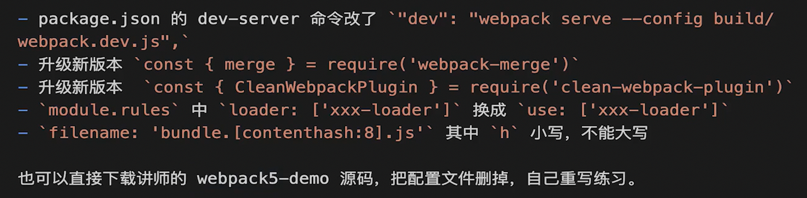

# 打怪刷副本

## HTML

### 如何理解HTML语义化

+ 让人更容易读懂，增加代码可读性
+ 让搜索引擎更容易懂 （SEO搜索引擎优化）

### 块级元素和内联元素

display：block/table  独占一行 div  h1  table ul ol p

display：inline/inline-block 从左往右排，直到换行  span img  input button

## CSS

### 布局

#### 盒子模型的宽度如何计算？

offsetWidth = 内容宽度 + 内边距 + 边框 

而当加入 `box-sizing: border-box`之后，width就是offsetWidth。这会牺牲内容宽度

#### margin纵向重叠的问题。

相邻元素的margin-top和margin-bottom会发生重叠

**注意**空白内容的<p/>标签也会重叠

```html
<p>
    丁凯乐
</p>
<p></p>
<p></p>
<p></p>
<p>
	快乐星球
</p>
```

```css
p{
    margin-top: 15px,
    margin-bottom: 10px
}
```

最终结果显示的是丁凯乐和 快乐星球之间相差的是15px

原因是中间几个p是没有content的，所以只有单纯的margin；而上下margin重合了，最终结果就是15px

#### margin负值的问题 

只有top和left会影响自身的位置

right 会让自己的右边的元素左移动

bottom会让下面的元素向上移动

#### BFC理解和应用

**概念**：块级格式化上下文， 一块独立的渲染区域，内部元素的渲染不会影响边界以外的元素

**形成BFC的常见条件：**

+ float 不是none 
+ position是absolute或者fixed
  + 绝对定位和固定定位会让元素提升为一个新的合成图层以提高渲染。所以不在同一个图层中，自然不会影响到。
    + 图层创建的主要原因有：
      + 使用了transform或opacity
      + will-change， 如果元素的will-change属性声明了某些可能变化的元素，也可能触发
      + 动画和过度
+ overflow不是visible
+ display是flex  inline-block等

**BFC的常见应用：清除浮动**

```css
.clearfix::after {
  content: "";
  display: block;
  clear: both;
}
```

```css
.clearfix {
  overflow: hidden;
}
```


#### 圣杯布局和双飞翼布局

目的： 三栏布局，中间一栏最先加载和渲染（内容最重要）;两侧内容固定，中间内容随着宽度自适应

**实现方式**

+ 
+ 

### 响应式

#### 如何实现响应式？

+ 通过媒体查询  media-query 根据不同的屏幕尺寸设置根元素的font-size；然后是用rem基于根元素的font-size的相对单位
+ vh   vw   vmax（两者最大值） vmin(两者取最小值)

### 定位

#### absolute和relative分别依据什么定位？

#### 居中对齐有哪些方式？

##### 水平居中

inline元素： text-align: center

block元素： margin: auto

absolute 元素： left：50%； margin-left 负值（需要知道width）或者transform： translate-x: -50%

##### 垂直居中

inline元素： line-height 的值等于height值

absolute元素： top: 50% + margin-top 负值（需要直到height） 或者transform 

absolute元素： top, left, bottom, right = 0 ; margin: auto

### CSS3

#### 动画

### 图文样式

#### line-height的继承问题

+ 写具体值
  + 如40px， 那么就直接是继承这个值
+ 写数值
  + 如1.5，  那么就继承它的比例，具体值是 该元素的font-size 乘以这个比例数值
+ 写百分比
  + 如200%， 那么就在当前这个父元素中，将font-size * 200%  得到准确的象素值了之后，再相当于写具体值一样的往下继承


## JS

### 事件循环

同步代码在调用栈中顺序执行。执行结束之后。时间循环开始工作

轮询查找 callback queue 回调队列中是否有任务，如果有进入到call stack中执行

然后继续一直轮询查找


### promise

pending   —resolve变成—  fulfilled

pending  —rejec或者throw error变成— rejected

三种状态是不可逆的


#### then 和catch的链式调用

then()正常返回的是一个resolve的promise， 如果没有报错，则可以继续.then();  如果有报错的话，就不能进.then  而是进 .catch。


catch()正常返回的也是一个resolve的promise。情况同上；切记不要以为.catch()之后出来的promise 还是触发.catch


```ts
Promise.resolve().then(() => {
    console.log(1)
    thorw new Error('错误')
}).catch(() => {
    console.log(2)
}).then(() => {
    console.log(3)
})
```

注意上面这道题是有一个陷阱的

正常应该打印1 2 3  

因为在打印2之后， catch执行返回的也是一个resolve的promise。它是可以进.then的


#### async/await

坑是： await的后面，都可以看作callback里的内容，及异步。

类似于`setTimeout(() => {await 之后的代码块})` 或者 `Promise.resolve(() => {await 之后的代码块})`

```js
async function async1 () {
    console.log(1)
    await async2()
    console.log(2)
}

async function async2 () {
    console.log(3)
}

console.log(4)
async1()
console.log(5)
```

陷阱答案是： 4   1  3  2  5

正确答案是： 4   1   3  5  2


再来一道易错题：

```js
async function async1 () {
    console.log("async1 start")
    await async2()
    console.log("async1")
    await async3()
    console.log("async1 end")
}

async function async2 () {
    console.log("async2 start")
    await async3()
    console.log("async2 end")
}

async function async3 () {
    console.log("async3")
}

console.log("start")
async1()
console.log("end")
```

````css
start

async1 start

async2 start

async3

end

async2 end

async1

async3

async1 end
````

解题的关键是： await  fun()    

其中fun体内 如果 没有 await 就全部执行

有await 的话：  await之前的代码都执行，await 之后的代码都放入 event loop当中

先碰到的，先放进去


#### 宏任务和微任务

宏任务： setTimeout   setInterval   Ajax   DOM事件

​	浏览器规定的

微任务：Promise  async/await

​	由ES6语法规定的

微任务执行时机比宏任务要早


#### event loop 和DOM渲染

 每一次call stack 清空（同步代码执行完毕）

都是DOM重新渲染的机会，DOM结构如有变化则重新渲染

然后再去触发下一次Event Loop


微任务是在DOM渲染之前触发； 

宏任务是在DOM渲染之后触发


**过程**：

+ Call Stack 清空
+ 执行微任务队列
+ 进行DOM渲染
+ 执行宏任务队列


平常宽泛的过程是把 微任务队列和宏任务队列混在一起了


```js
async function async1 () {
    console.log("async1 start")
    await async2()
    console.log("async1 end")
}

async function async2 () {
    console.log("async2")
}

console.log("start")

setTimeout(() => {
    console.log("setTimeout")
})

async1()

new Promise (function (resolve) {
    console.log("promise1")
    resolve()
}).then(function () {
    console.log("promise2")
})

console.log("end")
```

```css
start

async1 start

async2

promise1

end

async1 end

promise2

setTimeout
```


#### 手写promise

属性有：

+ state
+ value
+ reason
+ resolveCallbacks
+ rejectCallbacks
+ then
+ catch

构造函数：

```js
constructor(fn) {
	const resolveHandler = (value) => {
		if (this.state === "pending") {
            this.state = "fulfilled"
            this.value = value
            this.resolveCallbacks.forEach(fn => fn(this.value))
        }
	}
	const rejectHandler = (reason) => {
		if (this.state === "pending") {
            this.state = "rejected"
            this.reason = reason
            this.rejecteCallbacks.forEach(fn => fn(this.reason))
        }
	}
	
	try {
		fn(resolveHandler, rejectHandler)
	} catch (error) {
		rejectHandler(err)
	}
}
```
**注意： 在这里要做一个类型判断，如果传入的不是一个函数的话，后面会进行不下去，所以在这里会进行默认类型转换成一个函数**

在then里面是有三种状态去处理的，如果状态已经兑现了，那么就直接执行，返回一个新的promise对象即可

如果还是pending的状态，那么才要放到队列当中等待执行

```js
then(fn1, fn2) {
	fn1 = typeof fn1 === "function" ? fn1 : (v) => v
  fn2 = typeof fn2 === "function" ? fn2 : (e) => e
    
    if (this.state === "pending") {
        const p1 = new MyPromise((resolve, reject) => {
            this.resolveCallbacks.push(() => {
                try {
                    const newValue = fn1(this.value)
                    resolve(newValue)
                } catch (err) {
                    reject(err)
                }
            })
            
            this.rejectCallbacks.push(() => {
                try {
                    const newReason = fn2(this.reason)
                    reject(err)
                } catch {
                    reject(err)
                }
            })
        })
        return p1
    }
    
    if (this.state === "fulfilled") {
        const p1 = new MyPromise((resolve, reject) => {
            try {
                const newValue = fn1(this.value)
                resolve(newValue)
            } catch (err) {
                reject(err)
            }
        })
    }
    
    if (this.state === "rejected"){
        const p1 = new MyPromise((resolve, reject) => {
            try {
                const newReason = fn2(this.reason)
                reject(newReason)
            } catch (err) {
                reject(err)
            }
        })
        return p1
    }
        
    
    
}

catch(fn) {
    return this.then(null, fn)
}
```

Promise的API

需要注意的是，**并非在Promise的定义中写，而是在其原型链上写**

```js
MyPromise.resolve = function (value) {
	return new MyPromise(resolve => resolve(value)) 
}

MyPromise.reject = function (reason) {
    return new MyPromise((resolve, reject) => reject(reason))
}
```


### 变量类型和计算 

#### 常见数据类型

常见的值类型（原始数据类型） undefined  string  number  boolean  **symbol**  **null**

常见的引用数据类型 object  array  function 

**注意： type of null 返回的是 object， 这只是语言设计中的历史遗留问题，**


#### 手写深拷贝

```js
function deepClone (obj = {}) {
	if (typeof obj !== "object" || obj == null) {
        return obj
    }
    let result
    if (obj instanceof Array) {
        result = []
    } else {
        result = {}
    }
    
    for (let key in obj) {
        if (obj.hasOwnProperty(key)) {
            result[key] = deepClone(obj[key])
        }
    }
    
    return result
}
```


#### 字符串拼接

万物加上字符串都是字符串

```js
ture + '10'   // 'ture10'
null + '10'   // 'null10'
```


#### 双等的特殊情况

```js
const obj = {x: 109}
if (obj.a == null) {}

// 相当于
if (obj.a === null || obj.a === undefined)
```


### 原型和原型链

每个class 都有显示原型prototype

每个实例都有隐式原型 `__proto__`

实例的`__proto__`指向对应class的prototype

#### 如何准确判断一个变量是不是数组 

```js
const a = []
console.log(a instanceof Array)
```

#### 手写一个简单的jQuery，考虑插件和扩展性

```js
class jQuery {
    constructor(selector) {
        const result = document.querySelectorAll(selector)
        const length = result.length
        for(let i = 0; i < length; i++) {
            this[i] = result[i]
        }
        this.length = length
    }
    get(index) {
        return this[index]
    }
    each(fn) {
        for(let i = 0; i < this.length; i++) {
            fn(this[i])
        }
    }
    on(type, fn) {
        return this.each(elem => {
            elem.addEventListener(type, fn, false)
        })
    }
}

```


#### class的原型本质，怎么理解？

实例.`__proto__` = 原型.prototype


### 作用域和闭包

作用域就是变量的合法的适用范围，逃出作用域范围访问变量会出错

闭包是作用域应用的特殊情况，有两种表现：

+  函数作为参数被传递
+ 函数作为返回值被返回

闭包： <span style="color: red">自由变量的查找是在函数定义的地方，向上级作用域查找，而不是在执行的地方向上查找</span>

​	

#### this的不同应用场景，如何取值？

this取什么值，是在函数执行的时候决定的，而不是函数定义的时候决定的


在使用setTimeout函数的时候，如果传入的是一个function申明的函数，那么其中的this就是window

如果想要其中的this是该作用域下的this的话，就用箭头函数申明


#### 手写bind函数

这里有一个重点： <span style= "color: red">获取arguments的方式是Array.prototype.slice.call(arguments)</span>

```js
Function.prototype.myBind = fucntion () {
    args = Array.prototype.slice.call(arguments)
    const t = args.shift()
    const self = this
    return fucntion () {
        return self.apply(t, args)
    }
}
```

#### 实际开发中闭包的应用场景，举例说明

+ 隐藏数据,只提供API

  ```js
  fucntion createCache() {
      const data = {}
      return {
          set: function (key, value) {
              data[key] = value
          },
          get: function (key) {
              return data[key]
          }
      }
  }
  
  const c = createCache()
  c.set('a', 100)
  console.log(c.get('a'))
  ```

  这样可以对data进行保护，数据私有化，外部无法直接修改data，每一次访问和设置都可以人为控制


### 单线程和异步

+ （异步和同步的区别）：异步不会阻塞代码执行，同步会阻塞代码执行

+ JS是单线程语言，只能同时做一件事
+ 浏览器和nodejs支持JS启动进程，如web worker
+ JS和DOM渲染公用同一个线程，因为JS可以修改DOM结构


#### 异步的应用场景

+ 网络请求，如ajax图片加载
+ 定时任务， 如setTimeout


#### 手写一个Promise加载图片的函数

```js
function loadImg(src) {
    const p = new Promise((resolve, reject) => {
        const img = document.createElement('img')
        img.onload = () => {
            resolve(img)
        }
        img.onerror = () => {
            const err = new Error(`图片加载失败 ${src}`)
        }
        img.src = src
    })
    return p
}
```

```js
loadImg(url).then(img => {
    console.log(img.width)
    return img
}).then(img => {
    console.log(img.height)
}).catch(err => {
    console.log(err)
})
```


## JS Web API


### DOM

是从HTML语言中解析出来的一棵树

#### 获取DOM节点

```js
document.getElementById('div')

document.getElementsByTagName('div')

document.getElementsByClassName('.dingkaile')

document.querySelectorAll('p')
```

#### DOM节点的属性

#### property

修改对象属性，不糊体现到html结构中

```js
console.log(p.style.width)
p.style.width = '100px'
console.log(p.className)
p.className = 'p1'
console.log(p.nodeName)
console.log(p.nodeType)
```

#### attribute

修改html属性，会改变html结构 

```
p.getAttribute('data-name')
p.setAttribute('data-name', 'dingkaile')
p.getAttribute('style')
p.setAttribute('style', 'font-size: 30px')
```

#### 总结

尽量用property进行操作，因为property在js中可能会避免DOM的重复渲染，而attribute是肯定重新渲染


#### DOM节点操作

#### 新增/插入节点

```js
const div1 = document.getElementById('div1')

const p1 = document.createElement('p')

p1.innerHTML = 'this is p1'

div1.appendChild(p1)

const p2 = document.getElementById('p2')
div1.appendChild(p2) // 注意，这个操作是移动，而不是复制

```


#### 获取子元素列表&获取父元素

```js
const child = div.childNodes
```

```js
const parent = div.parentNode
```

#### DOM性能问题

+ DOM操作非常‘昂贵’，应该避免频繁的DOM操作
+ 对DOM查询做缓存
+ 将频繁操作改为一次性操作

**缓存**

```js
// 不缓存DOM查询结果
for (let i = 0; i < document.getElementByTagName('p').length; i++) {
    // 每次循环，都会计算length， 频繁进行DOM查询
}

// 缓存 DOM 查询结果
const pList = document.getElementsByTagName('p')
const length = pList.length
for (let i = 0; i < length; i++){
    // 缓存 length， 只进行一次DOM查询
}
```

**多次化作一次操作**

创建一个文档片段，在文档判断fragment中将需要执行的高频操作的东西弄好，然后再将fragment插入到DOM树中

```js
const listNode = document,getElementById('list')
// 创建一个文档片段，此时还没有插入到 DOM 树中
const frag = document.createDocumentFragment()
//执行插入
for(let x = 0; x < 10; x++) {
    const li = document.createElement("li")
    li.innerHTML = "List item" + x
    frag.appendchild(li)
}
//都完成之后，再插入到 DOM 树中
listNode.appendChild(frag)
```

### BOM

#### 浏览器信息

```js
const ua = navigator.userAgent
const isChrome = ua.indexOf('Chrome')
console.log(isChrome)
```

有些网站只识别某一些浏览器，所以现在很多浏览器都加上了别的浏览器的识别标识。乱套了


#### 屏幕信息

```js
screen.width
screen.height
```


#### Location

+ href： 整个网址
+ protocol： 协议
+ host：域名
+ search： 参数
+ hash： 哈希
+ pathname：路径


#### history

+ back(): 后退
+ forward()： 前进 


### 事件

####  事件绑定

```js
const bt = document.getElementById('bt1')
bt.addEventListener('click', event => {
    console.log(evnet.target) // 获取触发的元素
    event.preventDefault() // 阻止默认行为
    // 函数逻辑
})
```


#### 阻止冒泡

子盒子被触发事件（点击/滑动/等等），默认父盒子也会被触发到该事件， 如果父盒子也注册了该事件的回调函数，那么子盒子和父盒子都会执行

```js
event.stopPropagation()
```


#### 事件代理

利用了冒泡机制，不在子盒子上注册事件，而是再父盒子中进行注册。然后在回调函数中，通过event.target获取到触发事件的具体子盒子是谁，进行逻辑执行

动态的生成大量的DOM元素的时候，因为无法提前拿到生成的元素，这种情况下需要用到事件代理

当今的VUE和react都使用了虚拟DOM，不需要手动实现事件代理，因为它们已经自动优化了事件绑定和处理。


#### 无限下拉图片列表，如何监听每个图片的点击？

```
$0 = <section class="hi-icon flex items-center justify-center overflow-hidden bg-cover icon-home-pure cursor-pointer overflow-visible" data-v-59d18cec="" data-v-3604ec04-s="" style="background-image: url(&quot;https://static.wetab.link/user-custom-icon/zh/64c11298978ec9e65cbe6738/user-custom-icon1h7c236g8tut6ufgnew10xc1rde.png?imageMogr2/thumbnail/176x/format/webp/blur/1x0/quality/100|imageslim&quot;);"><!----></section>

$0.matches('a')
false
$0.matches('section')
```

`元素.matches(标签名称)` 可以判断该元素是不是该tagetType

实现方法： 

+ 事件代理
+ 用e.target获取触发元素
+ 用matches来判断是否为img，如果是则执行回调


## ajax

### XMLHttpRequest

```js
const xhr = new XMLHttpRequest()
xhr.open('POST', '/data/test.json', true) // ture 是指定异步， 如果不指定，则会卡顿等待请求
xhr.onreadystatechange = function () {
    if (xhr.readyState === 4) {
        if (xhr.status === 200) {
            console.log(JSON.parse(xhr.responseText))
            alert(xhr.responseText)
        } else {
            console.log('其他情况')
        }
    }
}

const postData = {
    userName: 'dingkaile'
    age: 13
}
xhr.send(JSON.stringfy(postData)) // 有请求参数就填上请求参数, 没有请求参数就给null
```

#### xhr.readyState

+ 0  尚未调用open方法
+ 1 open方法已经被调用
+ 2 send方法已经被调用，响应header已经被接收
+ 3 下载中， responseText已经有部分内容
+ 4 下载完成


#### xhr.status

+ 2xx  成功处理请求， 如200
+ 3xx  需要重定向，浏览器直接跳转
  + 301 永久重定向
  + 302  临时重定向
  + 304  资源未改变，使用缓存 
+ 4xx  客户端请求错误
  + 404 网络地址错误
  + 403 权限限制
+ 5xx 服务端报错


### 同源策略

ajax请求时，浏览器要求当前页面和server必须同源

同源： 协议、域名、端口 三者必须一致

  <link> <script> 这些标签地址都是可以跨域的

不过有些图片的服务端会做防盗链的限制，这样的话就会拿不到


### 跨域

所有的跨域都必须经过server端允许和配合

未经过server端允许就实现跨域，说明浏览器有漏洞，危险信号


#### JSONP

1. **创建一个`<script>`标签**，该标签的 `src` 属性指向目标服务器的 URL，并在 URL 中添加回调函数的名称。
2. **服务器返回包含回调函数的 JSON 数据**，回调函数的名称通常在 URL 中作为参数传递给服务器。
3. **浏览器执行返回的 JavaScript 代码**，这段代码会调用回调函数，并将 JSON 数据作为参数传递给它。

- 只能进行 `GET` 请求，不能使用 `POST`。
- 存在一定的安全风险，可能会被恶意服务器利用执行不安全的脚本代码。
- 只能用于获取数据，不能像 AJAX 那样直接操作 HTTP 请求头或处理响应状态码等。

```js
function handleResponse(data) {
    console.log(data);
}

// 创建一个 <script> 标签，src 指向目标服务器
var script = document.createElement('script');
script.src = 'http://example.com/data?callback=handleResponse';  // 假设这个 URL 会返回 `handleResponse({})` 的数据
document.body.appendChild(script);
```


## 存储

### cookie

+ 本身用于浏览器和server通讯
+ 可以用 `document.cookie= '....'`的方式来修改
  + 同一个key会覆盖，不同的key会追加
+ 页面不管怎么刷新，都还会在
+ 储存空间只有4kb
+ 发送请求的时候都会带上，增加了数据量


### localStorage

+ HTML5Z专门为存储而设计的，最大可以存5M
+ 每个域名都独自有5M


### sessionStorage

+ 数据只存在于当前会话，浏览器关闭则清空


## HTTP

### http状态码

+ 1开头： 服务端已经收到了请求
+ 2开头： 请求成功
+ 3开头： 重定向
+ 4开头： 客户端错误
+ 5开头： 服务端错误


**常见的状态码：**

+ 200  成功
+ 301  永久重定向
+ 302  临时重定向 
+ 304  资源未被修改 （使用本地缓存）
+ 404  资源未找到
+ 403  权限受限
+ 500  服务器错误
+ 504  网关超时。（一台服务器连接另一台服务器的过程中超时了）

 

### Resful API

+ 不使用url参数
+ method表示操作类型
  + post请求做提交
  + get请求做获取
  + patch请求做修改


传统：

​	post：  /api/create-blog

​	post:    /api/update-blog?id=100

​	get:      /api/get-blog?id=100


Resful:

​	post:	/api/blog

​	patch:      /api/blog/100

​	get:	  /api/blog/100


### 常见的headers

#### Request：

+ Accept： 浏览器可接收的数据格式
+ Accept-Encoding： 浏览器可接收的压缩算法，如gzip
+ Accept-Languange: 浏览器可接收的语言，如zh-CN
+ Connection: keep-alive：  一次TCP连接重复使用
  + 与服务端建立连接了之后，可以重复的使用这个连接，没必要重新断开再重新连接。把资源一次性的请求完成
+ cookie： 每次请求自动带上的
+ Host： 请求的域名
+ User-Agant: 简称UA  浏览器信息
+ Content-type 发送数据的格式，如 application/json


#### Response：

+ Content-type: 返回数据的格式，如 application/json 
+ Content-length： 返回数据的大小，多少字节
+ Content-Encoding: 返回数据的压缩算法
+ Set-Cookie：服务端要向客户端设置cookie的时候返回的


### http缓存

####  哪些资源可以被缓存？

静态资源：js  css  img

​	webpack打包之后会给静态文件生成一个hash，当静态文件替换了之后，hash会重新生成


#### 强制缓存

设置或过期时间，在一定的时间内，都是从本地缓存中获取的

#### cache-control

+ max-age: 最大过期时间
+ no-cache: 不用本地缓存，每次都请求新的文件
+ no-store： 不用本地缓存，也不用服务端的缓存措施
+ private：只允许用户端缓存
+ public: 允许中间的路由/代理进行缓存


#### Expires

已经被Cache-Control代替了，用于控制缓存过期的


#### 协商缓存（对比缓存）

服务端缓存策略，由服务端判断资源文件是否使用缓存；

 服务端判断客户端资源是否与服务端资源一样

如果一样，就返回304， 否则返回200 和最新的资源  


**资源标识：**

+ Last- Modified: 资源的最后修改时间
  + 初次请求，服务端返回资源，并在响应头中带上 Last-Modified；
  + 再次请求的时候，请求头中带上 If-Modified-Since （就是之前的Last-Modified）
  + 如果一样就返回304
  + 如果不一样就返回新的 资源，并返回新的Last-Modified
+ Etag: 资源的唯一标识（一个字符串，类似于人类的指纹）
  +  和上面一样的逻辑
  + 响应头中是Etag
    + 请求头中带的是 If-None-Match	


**推荐用Etag**

因为Last-Modified只能精确到秒级

如果资源重复生成，而内容不变，则Etag更精准；因为Etag是根据内容进行计算得出的


####  总结

强制缓存是有一个过期时间，在保质期内，都是使用缓存

协商缓存是有对比，对比Last-Modified 或者Etag，从而决定是否使用缓存


#### 刷新页面对缓存的影响

正常刷新： 地址栏输入url、跳转链接、前进后退等等

​	**两种缓存都有效**

手动刷新： F5， 点击浏览器刷新按钮

​	浏览器会检查资源的有效期，从而强制重新请求资源，但依然会带上If-Modified-Since和If-None-Match

​       **强制缓存失效，协商缓存有效**

强制刷新： ctrl + F5

​	**两种缓存都失效**


### http协议

#### http和https的区别：

http是明文传输，敏感信息容易被中间劫持

https =  http + 加密


#### 加密方式：

+ 对称加密： 一个key负责加密和解密。（key是服务端传输给客户端的，还是一样的不安全）
+  对称加密： 一对key， A加密之后，只能用B来解密
  + 服务端把公钥传输给客户端，客户端记住了公钥
  + 后续客户端就是用公钥来加密数据，传送给服务端
  + 服务端使用私钥进行解密

**https同时用到了这两种加密方式**

因为非对称加密的成本比较高，对称加密的成本比较低

+ 所以：
  + 服务端给客户端公钥
  + 客户端收到公钥后，把对称加密的密钥通过公钥加密后发送给服务端
  + 服务端收到后，用私钥解析出来密钥
  + 后期双方就都用这个密钥进行交流


#### 证书

为了防止中间人攻击

中间人攻击的过程:

+ 服务端给客户端发送公钥，中间人劫持了这个公钥
+ 给客户端发送了个假公钥
+ 用户端使用假公钥加密，并发送给服务端，中间人劫持，用自己生成的假公钥解析出明文
+ 用公钥加密，传输给服务端
+ 从此，中间人就可以用自己的假公钥劫持用户端和服务端的加密信息了

解决这一关键问题在于验证公钥是不是真的。所以就有证书这个东西


证书的工作流程：

+ 客户端请求地址
+ 服务端收到后，发送一个证书给用户端
+ 用户端使用这个证书向证书平台做验证
+ 验证失败，页面提示证书有危险
+ 验证通过： 提取证书中的公钥，进行后续的事情


所以如果有中间人攻击，把证书的公钥替换掉了，那么证书的鉴定就会失败，从而告警用户

完整的流程：

+ 证书验证
+ 非对称加密
+ 对称加密


## 网页渲染过程

+ 域名解析得到IP
+ 根据IP地址向服务器发起http请求
+ 服务端处理请求，并返回浏览器
+ 根据HTML代码生成 DOM tree
+ 根据css 生成CSSOM
+ 二者整合成Render Tree
+ Render Tree 渲染页面，遇到<script>标签暂停渲染，优先加载并执行js代码


<link rel="stylesheet" type="text/css" href="..."/> 应该放在<head/>中

<link rel="javascript" type="text/javascript" href="..."/> 应该放在<body/>最后。  

 

### window.onload和DOMContentLoaded的区别

````js
window.addEventListener('load', function() {
    // 页面的全部资源加载完才会执行，包括图片资源、视频资源等等
})

document.addEventListener('DOMContentLoaded', function() {
  // DOM 渲染完即可执行，此时图片、视频可能还没有加载完。但是已经有了占位空间了，资源来了就直接重绘展示就行了。  
})
````

一般是用DOMContentLoaded


## 性能优化

### 原则

+ 多使用内存，缓存或者其他方法
+ 减少CPU计算量。减少网络加载耗时
+ 空间换时间


### 路径

+ 让加载更快
  + 减少资源体积： 压缩代码 
  + 减少访问次数： 合并代码、精灵图、ssr服务端渲染、缓存
  + 使用更快的网络： CDN
    + cdn是根据不同的区域对服务进行处理，不同的区域访问到的ip是不一样的，就近原则
+ 让渲染更快
  + css放在head，js放在body最下面
  + 尽早开始执行js， 用DOMContentLoaded触发
  + 懒加载（上滑加载更多）
  + 对DOM查询进行缓存
  + 频繁DOM操作，合并到一起插入DOM结构


**实例**

+ 资源合并

  ```html
  <script src="a.js"></script>
  <script src="b.js"></script>
  <script src="c.js"></script>
  ```

  ```html
  <script src="abc.js"></script>
  ```

+ 缓存

  在webpack打包的时候，文件名带上hash

  ```
  output:{
  	filename: 'bundle.[contenthash].js',
  	path: path.join(__dirname, 'dist')
  }
  ```

  文件名没变，则url不变，会自动触发浏览器http缓存机制，返回304


## Linux

查看文件列表

```
ll
```

```
ls
```

修改文件名

```
mv index.html index1.html
```

移动文件

```
mv index.html ../index.html
```

拷贝

```
cp a.js  a1.js
```

删除文件

```
rm a.js
```

删除文件夹

```
rm -rf dist
```

创建文件

```
touch a.js
```

```
vi a.js
```


# 初级实战

##### typeof能判断哪些类型

+ undefined  string  number boolean  symbol 
+ object （typeof null === 'object'）
+ function


##### 强制类型转换和隐式类型转换

+ 强制： parseInt   parseFloat   toString
+ if、  逻辑运算  、 ==  、 字符串拼接


##### 手写trim

```js
String.prototype.myTrim = function () {
	return this.replace(/^\s+/, ''/).replace(/s+$/, '')
}
```


##### 获取url中的query参数

```js
function query(name) {
    const search = location.search
    const p = new URLSearchParams(search)
    return p.get(name)
}
```


##### 阻止事件冒泡和默认行为

```
event.stopPropagation()
event.preventDefault()
```


##### Map和Object的区别

+ Map可以以任意类型作为key
+ Map是有序结构，对象是无序结构
+ Map操作同样很快


##### Set和数组的区别

+ Set元素不能重复
+ Set是无序结构，操作很快


##### weakMap

+ 弱引用，防止内存泄漏
+ 只能用对象作为key
+ 没有forEach和size
+ 只能用add  delete   has

应用场景：

​	当我想给一个对象添加一个属性，属性值是另一个对象的时候。

​	加入被关联的对象在不再需要用到的时候，本来是想要垃圾回收掉的，但是因为被主对象的属性关联了，所以销毁不掉；这个时候就可以用weakMap给他们建立连接。这样就可以了。

​                           

# VUE

##  v-html

1. **从后台获取富文本内容**：如果你从后端接口获取的是 HTML 字符串，并且需要直接将其渲染为 HTML 格式，可以使用 `v-html`。比如，获取文章内容时，后台返回的可能是带有标签的 HTML 格式内容。

   ```
   html<div v-html="articleContent"></div>
   ```

2. **渲染 HTML 模板**：有时候需要动态生成 HTML 结构并展示出来，这时可以使用 `v-html` 来插入 HTML 代码。

   ```
   html<div v-html="dynamicHtml"></div>
   ```

3. **需要解析和渲染的字符串**：比如用户输入的某些内容需要经过解析并渲染成 HTML，而不是直接作为纯文本显示。

**注意事项：**

+ **替换覆盖：**一旦使用了v-html之后，他的子元素内容都将被v-html引用的html字符串替换掉

- **XSS 攻击的风险**：如果渲染的内容来自用户输入或者不可信的来源，要特别小心防范 XSS（跨站脚本攻击）。你需要确保渲染的 HTML 内容是经过适当清理或过滤的。
- **性能考虑**：过度使用 `v-html` 可能会影响性能，尤其是在内容频繁更新的情况下。Vue 会对内容进行解析和重渲染，可能导致不必要的 DOM 操作。

通常，只有在需要直接插入 HTML 内容时才会使用 `v-html`，而其他情况下尽量使用 Vue 的模板语法来保持数据的安全性和清晰性。


## **computed和watch**

+ computed有缓存，data不变则不会重新计算 

+ watch

  + 值类型的数据，可以拿到oldvalue

  + 引用数据类型的数据，只有当整个值的地址发生了变化的时候才会拿到oldvalue
  + 监听引用数据类型时需要加上deep才能监听到内部属性的变化，否则只有当整个值的地址发生变化的时候才会触发；当这个值的层级很深的时候，会影响性能，可以传入deep：2 只侦听两层

  + immediate 属性值可以决定刚刚进页面的时候是否触发

  + 传入一个getter函数会比deep侦听性能更高，并且在没有更改引用地址的情况下也能获取到oldvalue
  +  once: true  一次性侦听器


# webpack

## webpack 4 转变成webpack5的改动


